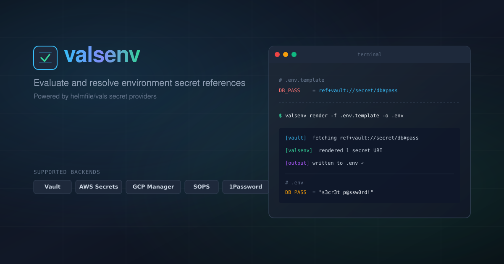

<p align="center">
  
</p>

# valsenv

`valsenv` resolves `ref+<backend>://` references inside dotenv (`.env`) files using [helmfile/vals](https://github.com/helmfile/vals). vals's own `eval`/`exec`/`env` commands only accept YAML/JSON, so `valsenv` fills the dotenv gap.

## What it does

You point `valsenv` at a dotenv stream. It reads each line, resolves any value that is a full `ref+` or `secretref+` reference into its real secret, and writes the rendered dotenv back out. Everything else (comments, blank lines, key order, plain values) passes through unchanged.

## Install

```
go install github.com/zoispag/valsenv@latest
```

Prebuilt binaries are also published on the [GitHub Releases](https://github.com/zoispag/valsenv/releases) page. An optional Homebrew tap may be available.

## Usage

```
valsenv render [-f file] [-o file] [--quote minimal|shell]
```

- `-f file`: input dotenv file. When omitted, `valsenv` reads from stdin.
- `-o file`: output file. When omitted, `valsenv` writes to stdout.
- `--quote minimal|shell`: quoting mode for resolved values (default `minimal`, byte-faithful). Use `shell` for `.env` files consumed via POSIX `source`/`.`, which single-quotes values so shell metacharacters (`;`, `$`, `` ` ``, spaces, …) are never expanded or split.

Example:

```
# in.env
API_KEY=ref+doppler://PROJECT/CONFIG/API_KEY
DB_PASSWORD=ref+vault://secret/data/db#/password
TIMEZONE=UTC

valsenv render -f in.env -o out.env
```

Every `ref+` value is replaced with its resolved secret. `TIMEZONE` stays as-is.

### Try it without a backend

The `echo` backend just returns its own path, so you can see the flow with no credentials:

```
printf 'A=ref+echo://hello\nT=UTC\n' | valsenv render
```

Output:

```
A=hello
T=UTC
```

### Raw file secrets: `valsenv get`

Some secrets are not environment variables at all — SSH private keys, PEM certificates, kubeconfigs. For those, `get` resolves a single reference and outputs the raw value, multiline included:

```
valsenv get [REF] [-f file] [-o file]
```

- `REF`: the reference as an argument, e.g. `ref+doppler://PROJECT/CONFIG/SSH_KEY`.
- `-f file`: read the reference from a file whose entire (whitespace-trimmed) content is one reference. When both `REF` and `-f` are omitted, reads from stdin.
- `-o file`: output file. When omitted, writes to stdout.

Unlike `render`, there are no dotenv semantics: no quoting, and the value is written exactly as the backend returns it (no trailing newline added or removed).

Example — commit a placeholder file containing only the ref, then resolve it in place:

```
# deploy_ssh_key (in git)
ref+doppler://PROJECT/CONFIG/DEPLOY_SSH_KEY

valsenv get -f deploy_ssh_key -o deploy_ssh_key
```

## Exit codes

- `0`: success.
- `1`: resolution or render failure. `valsenv` is fail-closed, so nothing is written on error (stdout stays empty and any `-o` target is left untouched).
- `2`: usage error.

## Backends

Resolution is handled by [vals](https://github.com/helmfile/vals), which supports a wide range of backends: Doppler, Vault, AWS Secrets Manager, GCP Secret Manager, 1Password, SOPS, and more. See the vals documentation for the full list and reference syntax.

Each backend reads its own credentials from the environment or standard credential sources (config files, instance metadata, ADC, and the like) — see the vals documentation for per-backend configuration.

## Behavior & limitations

- Comments, blank lines, and key order are preserved.
- Only values that are a complete `ref+` or `secretref+` reference are resolved. Plain values and embedded refs are left alone.
- `render` rejects multiline resolved values. Simple dotenv consumers split on newlines, so a secret containing a newline would corrupt the file. Use `get` for multiline secrets that live in their own file.
- A trailing inline comment after a ref value is not supported.

## License

MIT. See [LICENSE](LICENSE).
